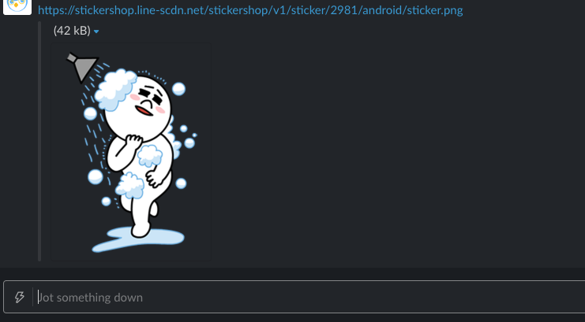

# lsl-web
Line sticker lider on web

## What is this
- On [Line Sticker shop](https://store.line.me/stickershop/home/general/en), There are "Sample" stickers.
- That stickers png file. That png file's image url, you can use for image link.
    - For example, Paste image link on Slack. If "Inline link option" is available, You can use sticker in Slack application.




## How to use

### Get sticker link

### Register new stickers


- docker
- docker-compose

# How to use (使い方)

Execute app/main.py at startup. Please change as necessary.  
起動時に app/main.py を実行します。必要に応じて変更してください。  

- startup (起動)

```sh
$ docker-compose up -d
```

- teardown (終了)

```sh
$ docker-compose down
```

- Example of access from client side (クライアント側からのアクセス例)

get

```sh
$ curl http://localhost:5001/
route get. Hello!
```

post

```sh
$ curl http://localhost:5001/reply -X POST -H "Content-Type: application/json" -d '{"keyword": "hoge"}'
{
  "Answer": {
    "Text": "route post. keyword is hoge!"
  },
  "Content-Type": "application/json"
}
```
